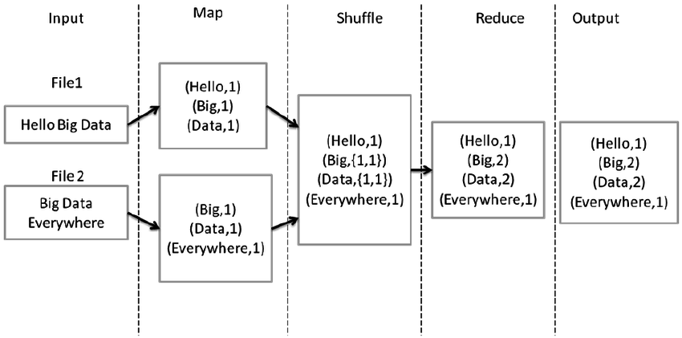

# CES-27 - LAB 1

Para saber mais sobre a entrega do trabalho, acessar: [Entrega](ENTREGA.md)

## Informações Gerais:

O bloco a seguir indica que um comando deve ser executado na linha de comando:
```shell
folder$ git --version
```
> git version 2.9.2.windows.1

**folder** é a pasta onde o comando deve ser executado. Caso esteja vazio, o comando deve ser executado na pasta raiz do projeto (ces27-lab1).
**$** indica o começo do comando a ser executado.
**git version 2.9.2.windows.1** é a saída no console.
## MapReduce

Nesse laboratório será implementada uma versão simplificada do modelo de programação MapReduce proposto por Jeffrey Dean e Sanjay Ghemawat no paper [MapReduce: Simplified Data Processing on Large Clusters](http://research.google.com/archive/mapreduce.html).
Implementações de MapReduce normalmente rodam em grandes clusters executando paralelamente e de forma distribuída milhares de tarefas. Além disso, é fundamental que as frameworks sejam capazes de lidar com problemas básicos presentes em sistemas distribuídos: falhas e capacidade de operar em larga escala.

O MapReduce é inspirado pelas funções map e reduce comumente utilizadas em programação funcional.

**Map**  
A função de Map é responsável por fazer um mapeamento dos dados de entrada em uma estrutura do tipo lista de chaves/valores. Esse mapeamento é executado de forma paralela para diversos dados de entradas gerando uma lista por *job* executado.

**Reduce**  
A função reduce recebe os resultados das funções de Map e faz uma sumarização dos valores obtidos, gerando uma nova lista de chaves/valores.

Além dessas, outras funções são normalmente utilizadas: Shuffle(ou Partition), que vai distribuir os resultados dos maps em várias partições (múltiplos reduces), garantindo que os dados que similares serão alocados na mesma partição para ser executado por um mesmo Reduce.

## Parte I - Execução sequencial

Nesse lab vamos implementar uma operação de contagem de palavras(word count). O nosso objetivo é conseguir processar grandes arquivos de textos e listar o número de vezes que cada palavra é utilizada. O pseudocódigo da operação (proposto no paper original) pode ser visto abaixo:

```python
map(String key, String value):
    # key: document name
    # value: document contents
    for each word w in value:
        EmitIntermediate(w, "1");

reduce(String key, Iterator values):
    # key: a word
    # values: a list of counts
    int result = 0;
    for each v in values:
        result += ParseInt(v);
    Emit(AsString(result));
```


Inicialmente o diretório da nossa aplicação MapReduce possui a seguinte estrutura:

* mapreduce\
	* common.go
	* mapreduce.go
* wordcount\
	* main.go
	* data.go
	* wordcount.go
	* wordcount_test.go
    * files\
        * pg1342.txt 

**mapreduce** é o pacote que implementa a framework MapReduce e deve se abster de detalhes da operação a ser realizada.
**wordcount** é o pacote que implementa a operação Contador de Palavras, e deve importar e extender as operaçãos da API provida pelo pacote acima.

**common.go**
Contém as definições dos dados que as aplicações devem extender para realizar uma operação de MapReduce. Além disso contém funções internas compartilhadas pela framework.

**mapreduce.go** 
Contém o código de inicialização da operação de MapReduce.

**main.go**
Contém o código de inicialização do programa.

**data.go**
Contém o código que lida com os dados que serão fornecidos e retornados pela operação de MapReduce.

**wordcount.go**
Contém o código que implementa as operações map e reduce.

### Atividade ###
Essa atividade serve também como introdução à linguagem Go.

Leia o código fornecido e entenda as estruturas básicas de leitura e gravação de dados que serão fornecidos e retornados pela operação de MapReduce nas funções *fanInData* e *fanOutData* no arquivo *data.go*

Leia a função *RunSequential* no arquivo *mapreduce.go* e entenda a execução sequencial da operação de MapReduce. Atenção nas chamadas das funções *Map* e *Reduce*.

As funções *Map* e *Reduce* (no arquivo *wordcount.go*) estão sem implementação. 


**Implementando Map e Reduce**

Abra o arquivo *wordcount.go* e implemente as funções **Map** e **Reduce** utilizando como base a imagem a seguir:



A saída de ambas as funções é uma estrutura do tipo *[]mapreduce.KeyValue*.

Note que na função de Map, na imagem temos vários elementos com a mesma chave. Uma outra possibilidade é retornar o total de ocorrências no arquivo. Neste caso, ao invés de retornar [(Car, 1), (Car, 1), (River, 1)], retornaríamos [(Car, 2), (River, 1)]. Ambos os casos devem funcionar corretamente.

Para verificar sua implementação, execute os testes fornecidos da seguinte forma na pasta *wordcount*:

```shell
wordcount$ go test -v
```
> === RUN   TestSplitData  
> --- PASS: TestSplitData (0.01s)  
> 	wordcount_test.go:60: Description: text file empty  
> 	wordcount_test.go:60: Description: text files bigger than chunk size  
> 	wordcount_test.go:60: Description: text file smaller than chunk size  
> 	wordcount_test.go:60: Description: text file has exact chunk size  
> === RUN   TestMapFunc  
> --- PASS: TestMapFunc (0.00s)  
> 	wordcount_test.go:120: Description: empty  
> 	wordcount_test.go:120: Description: one word  
> 	wordcount_test.go:120: Description: two words  
> 	wordcount_test.go:120: Description: repeated word  
> 	wordcount_test.go:120: Description: invalid character  
> 	wordcount_test.go:120: Description: newline character  
> 	wordcount_test.go:120: Description: multiple whitespaces  
> 	wordcount_test.go:120: Description: special characters  
> 	wordcount_test.go:120: Description: uppercase characters  
> === RUN   TestReduceFunc  
> --- PASS: TestReduceFunc (0.00s)  
> 	wordcount_test.go:191: Description: no entry  
> 	wordcount_test.go:191: Description: one entry  
> 	wordcount_test.go:191: Description: two entries with same keys  
> 	wordcount_test.go:191: Description: two entries with different keys  
> 	wordcount_test.go:191: Description: non-numeric counter  
> PASS  
> ok  	github.com/pauloaguiar/lab1-ces27/wordcount	0.039s  
    
É possível executar um teste isoladamente utilizando o parâmetro -run *regex*, onde *regex* deve ser substituído por uma expressão regular que vai ser comparada com os nomes das funções de teste.

```shell
wordcount$ go test -v -run Map
```
> === RUN   TestMapFunc  
> --- PASS: TestMapFunc (0.00s)  
> 	wordcount_test.go:120: Description: empty  
> 	wordcount_test.go:120: Description: one word  
> 	wordcount_test.go:120: Description: two words  
> 	wordcount_test.go:120: Description: repeated word  
> 	wordcount_test.go:120: Description: invalid character  
> 	wordcount_test.go:120: Description: newline character  
> 	wordcount_test.go:120: Description: multiple whitespaces  
> 	wordcount_test.go:120: Description: special characters  
> 	wordcount_test.go:120: Description: uppercase characters  
> PASS  
> ok  	github.com/pauloaguiar/lab1-ces27/wordcount	0.023s  


**Implementando splitData**

Para arquivos muito grandes, será necessário particionar o arquivo de entrada de forma a distribuir a carga em vários maps.

Abra o arquivo *data.go* e implemente a função **splitData**.

O objetivo dessa função é dividir grandes arquivos em arquivos menores, configurado pelo parâmetro chunkSize. Valores comuns em operações reais para o chunkSize são entre 15MB~65MB.

Para verificar sua implementação, execute os testes fornecidos da seguinte forma:

```shell
wordcount$ go test -v -run Split
```
> === RUN   TestSplitData  
> --- PASS: TestSplitData (0.01s)  
> 	wordcount_test.go:60: Description: text file empty  
> 	wordcount_test.go:60: Description: text files bigger than chunk size  
> 	wordcount_test.go:60: Description: text file smaller than chunk size  
> 	wordcount_test.go:60: Description: text file has exact chunk size  
> PASS  
> ok  	github.com/pauloaguiar/lab1-ces27/wordcount	0.039s  

**Executando MapReduce**

Na pasta *wordcount* execute:

```shell
wordcount$ go build
wordcount$ wordcount.exe -file files/pg1342.txt
```
> Running in local mode.  
> File: files\pg1342.txt  
> Reduce Jobs: 1  
> Chunk Size: 102400  
> Running RunSequential...  
> Fanning in file map\map-0  
> Fanning in file map\map-1  
> Storing locally.    MapId: 0        Len: 18038  
> Fanning in file map\map-2  
> Fanning in file map\map-3  
> Fanning in file map\map-4  
> Fanning in file map\map-5  
> Fanning in file map\map-6  
> Fanning in file map\map-7  
> Storing locally.    MapId: 1        Len: 17996  
> Storing locally.    MapId: 2        Len: 17894  
> Storing locally.    MapId: 3        Len: 17968  
> Storing locally.    MapId: 4        Len: 17819  
> Storing locally.    MapId: 5        Len: 18415  
> Storing locally.    MapId: 6        Len: 17824  
> Storing locally.    MapId: 7        Len: 17806  
> Fanning out file result\result-0  